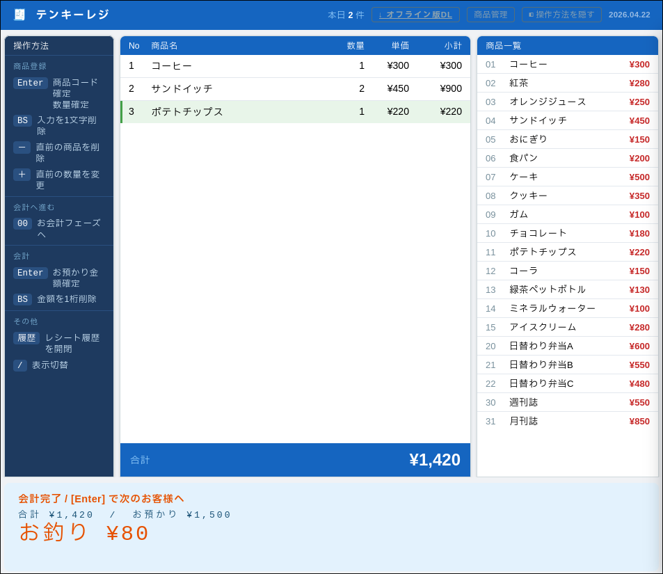

# テンキーレジシステム

テンキー（数字キーパッド）だけで操作できるシンプルなレジシステムです。  
Webブラウザで動作するシングルファイルHTML版と、ターミナルで動作するPython版の2種類があります。

## デモ

https://register-xju.pages.dev/



## ファイル構成

| ファイル | 説明 |
|----------|------|
| `index.html` | Webアプリ版（ブラウザで動作、サーバー不要） |
| `register.py` | CLIアプリ版（Python 3、追加ライブラリ不要） |
| `register_manual.md` | 使用説明書 |
| `register_offline.zip` | オフライン配布用ZIP（上記3ファイルを同梱） |

---

## Web版（index.html）

### 使い方

ローカルで使う場合は `index.html` をブラウザで開くだけで動作します。サーバーは不要です。

### 主な機能

- **商品コード入力**（2桁） → 数量入力 → カートに追加
- **00 + Enter** でお会計（お釣り計算）
- **レシート履歴**（localStorage に自動保存、YYYYMMDD-NNN形式で採番）
- **CSVエクスポート／インポート**（レシート履歴・商品マスター）
- **4テーマ切り替え**：ダーク／ライト／屋外／ハイコントラスト
- **効果音**：商品追加時のビープ音、会計時のドロワー音（Web Audio API）

### キー操作

| キー | 動作 |
|------|------|
| `01`〜`97` + Enter | 商品を選択 |
| `00` + Enter | お会計へ |
| `-` + Enter | 直前の商品をカートから削除 |
| `+` + Enter | 直前の商品の数量を変更 |
| Enter（数量入力時） | 数量1で確定（そのまま押す） |
| 数字入力後 Enter（数量入力時） | 入力値で確定 |

### 商品マスターの変更

ヘッダーの **商品管理** ボタンから、CSVファイルのインポート／エクスポートおよびデフォルトへのリセットができます。

CSVフォーマット（UTF-8 with BOM、Excelで編集可）:

```
コード,商品名,単価
01,コーヒー,300
02,紅茶,280
```

---

## Python版（register.py）

### 必要環境

- Python 3.x
- 効果音を使う場合（任意）: `sounddevice`, `numpy`

```bash
pip install sounddevice numpy
```

### 使い方

```bash
python3 register.py
```

### キー操作

| 入力 | 動作 |
|------|------|
| `01`〜`97` + Enter | 商品を選択 |
| `00` + Enter | お会計へ |
| `-` + Enter | 直前の商品をカートから削除 |
| `+` + Enter | 直前の商品の数量を変更 |
| `/` + Enter | 商品一覧を表示／非表示 |
| `99` + Enter | 終了 |

### 商品マスターの変更

`register.py` 先頭の `PRODUCTS` 辞書を直接編集します。

```python
PRODUCTS = {
    "01": ("コーヒー", 300),
    "02": ("紅茶",     280),
    ...
}
```

コードは `"01"`〜`"97"` の2桁文字列（`00`・`98`・`99` は予約済み）。

---

## オフライン配布

`register_offline.zip` に `index.html`・`register.py`・`register_manual.md` を同梱しています。  
インターネット接続なしで使用できます。

ZIPはソースファイルの変更時にGitHub Actionsが自動更新します。

---

## 🎁 Wishlist / 機材寄付募集

レシートプリンタ対応（Epson ePOS-Print SDK 利用）を実装したいのですが、実機がありません。
Epson製のePOS対応レシートプリンタ（TM-m30、TM-T88VIなど、新品／中古可）をご提供いただける方を募集しています。

詳細 → [#2 レシートプリンタ対応（Epson ePOS-Print SDK）＋機材寄付募集](https://github.com/kusanaginoturugi/register/issues/2)

---

## ライセンス

MIT License
